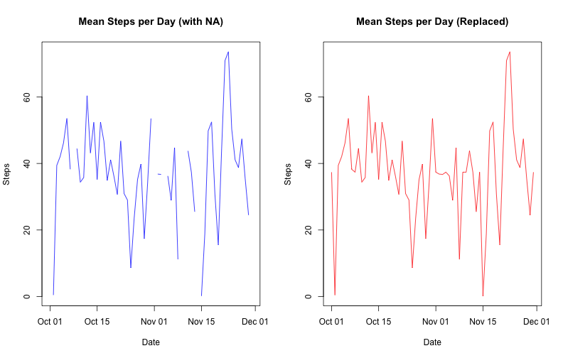
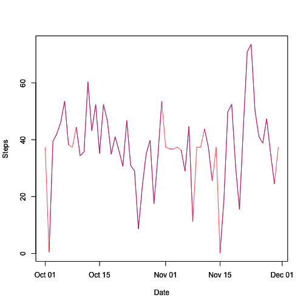

Reproducible Research Peer Assessment 1
========================================================
## Loading and preprocessing the data


We will first load the data into a data frame that we call activity.


```r
activity <- read.csv("~/Desktop/DataTrack/ReproducibleResearch/Assignment1/activity.csv",
               colClass=c("integer","character","integer"))
```

We have not done any processing here other than to assign classes to the columns. 

## What is mean total number of steps taken per day?

The data contains many entries that are marked as **NA**. For the first part of assignment we will omit those entries using the **complete.cases** command. We also rename the data frame **activityNA**.


```r
activityNA<-activity[complete.cases(activity),]
```

We now want to construct a histogram which displays the frequency of the total number of steps per day. To do this we use the function **ddply**, which requires the package **plyr**. This function will subset **activityNA** by the date perform the function **sum** on the number of steps, and then recombine everything into a new data frame that we call **Daily_Sum**. 


```r
library(plyr)
Daily_Sum<-ddply(activityNA,.(date),summarize,steps=sum(steps))
```
Here is the histogram which shows the frequency of the total number of steps per day. 

```r
hist(Daily_Sum$steps,breaks=20,xlab="Steps",main="Total Steps per Day")
```

 

To calculate the daily mean and daily median we again use the function **ddply**, but this time we apply the function **mean** and **median** inside of **ddply**. 


```r
Daily_Mean<-ddply(activityNA, .(date), summarize, daily_mean_steps=mean(steps))
Daily_Median<-ddply(activityNA, .(date), summarize, daily_median_steps=median(steps))
```

Here is a print out of the mean number of steps per five minute interval by the day. 

```r
Daily_Mean
```

```
##          date daily_mean_steps
## 1  2012-10-02           0.4375
## 2  2012-10-03          39.4167
## 3  2012-10-04          42.0694
## 4  2012-10-05          46.1597
## 5  2012-10-06          53.5417
## 6  2012-10-07          38.2465
## 7  2012-10-09          44.4826
## 8  2012-10-10          34.3750
## 9  2012-10-11          35.7778
## 10 2012-10-12          60.3542
## 11 2012-10-13          43.1458
## 12 2012-10-14          52.4236
## 13 2012-10-15          35.2049
## 14 2012-10-16          52.3750
## 15 2012-10-17          46.7083
## 16 2012-10-18          34.9167
## 17 2012-10-19          41.0729
## 18 2012-10-20          36.0938
## 19 2012-10-21          30.6285
## 20 2012-10-22          46.7361
## 21 2012-10-23          30.9653
## 22 2012-10-24          29.0104
## 23 2012-10-25           8.6528
## 24 2012-10-26          23.5347
## 25 2012-10-27          35.1354
## 26 2012-10-28          39.7847
## 27 2012-10-29          17.4236
## 28 2012-10-30          34.0938
## 29 2012-10-31          53.5208
## 30 2012-11-02          36.8056
## 31 2012-11-03          36.7049
## 32 2012-11-05          36.2465
## 33 2012-11-06          28.9375
## 34 2012-11-07          44.7326
## 35 2012-11-08          11.1771
## 36 2012-11-11          43.7778
## 37 2012-11-12          37.3785
## 38 2012-11-13          25.4722
## 39 2012-11-15           0.1424
## 40 2012-11-16          18.8924
## 41 2012-11-17          49.7882
## 42 2012-11-18          52.4653
## 43 2012-11-19          30.6979
## 44 2012-11-20          15.5278
## 45 2012-11-21          44.3993
## 46 2012-11-22          70.9271
## 47 2012-11-23          73.5903
## 48 2012-11-24          50.2708
## 49 2012-11-25          41.0903
## 50 2012-11-26          38.7569
## 51 2012-11-27          47.3819
## 52 2012-11-28          35.3576
## 53 2012-11-29          24.4688
```

Here is a print out of the median number of steps per five minute interval by the day. 


```r
Daily_Median
```

```
##          date daily_median_steps
## 1  2012-10-02                  0
## 2  2012-10-03                  0
## 3  2012-10-04                  0
## 4  2012-10-05                  0
## 5  2012-10-06                  0
## 6  2012-10-07                  0
## 7  2012-10-09                  0
## 8  2012-10-10                  0
## 9  2012-10-11                  0
## 10 2012-10-12                  0
## 11 2012-10-13                  0
## 12 2012-10-14                  0
## 13 2012-10-15                  0
## 14 2012-10-16                  0
## 15 2012-10-17                  0
## 16 2012-10-18                  0
## 17 2012-10-19                  0
## 18 2012-10-20                  0
## 19 2012-10-21                  0
## 20 2012-10-22                  0
## 21 2012-10-23                  0
## 22 2012-10-24                  0
## 23 2012-10-25                  0
## 24 2012-10-26                  0
## 25 2012-10-27                  0
## 26 2012-10-28                  0
## 27 2012-10-29                  0
## 28 2012-10-30                  0
## 29 2012-10-31                  0
## 30 2012-11-02                  0
## 31 2012-11-03                  0
## 32 2012-11-05                  0
## 33 2012-11-06                  0
## 34 2012-11-07                  0
## 35 2012-11-08                  0
## 36 2012-11-11                  0
## 37 2012-11-12                  0
## 38 2012-11-13                  0
## 39 2012-11-15                  0
## 40 2012-11-16                  0
## 41 2012-11-17                  0
## 42 2012-11-18                  0
## 43 2012-11-19                  0
## 44 2012-11-20                  0
## 45 2012-11-21                  0
## 46 2012-11-22                  0
## 47 2012-11-23                  0
## 48 2012-11-24                  0
## 49 2012-11-25                  0
## 50 2012-11-26                  0
## 51 2012-11-27                  0
## 52 2012-11-28                  0
## 53 2012-11-29                  0
```
Note that some days are acutally *missing* since every five interval during that day contained the value of **NA**. We have also included a time series plot by day for both the mean and the median. But first we must convert the date, which is currently a character to an acutal date, using the function **as.Date()**.

```r
Daily_Mean$date<-as.Date(Daily_Mean$date)
Daily_Median$date<-as.Date(Daily_Median$date)

par(mfrow=c(1,2))
plot(Daily_Mean$date,Daily_Mean$daily_mean_steps,type="l",xlab="Date",ylab="Steps")
title("Mean Steps per Day")
plot(Daily_Median$date,Daily_Median$daily_median_steps,type="l",xlab="Date",ylab="Steps")
title("Median Steps per Day")
```

 

## What is the average daily activity pattern?

To calculate the mean number of steps by interval we use **ddply** again but instead we split the data frame by intervals. 


```r
Interval_Mean<-ddply(activityNA, .(interval), summarize, interval_mean_steps=mean(steps))
```

The time series plot is graphed below with the interval on the horizontal axis and the mean number of steps on the vertical axis.

```r
plot(Interval_Mean$interval,Interval_Mean$interval_mean_steps,type="l",
     xlab="Interval",ylab="Steps",main="Mean number of Steps by Interval")
```

 

In order to find out which interval as the highest mean number of steps we order the data frame **Interval_Mean** by the entry **interval_mean_steps** using the function **order**.

```r
Order_Interval<-Interval_Mean[order(-Interval_Mean$interval_mean_steps),]
```

We now display the first row of **Order_Interval**

```r
Order_Interval[1,]
```

```
##     interval interval_mean_steps
## 104      835               206.2
```

Therefore we see that interval **835** on average contained the most number of steps per day.

## Imputing missing values
To calculate the number of **NA** rows we use the **complete.cases** command and then **sum**. Therefore the number of missing values is:

```r
print(nrow(activity)-sum(complete.cases(activity)))
```

```
## [1] 2304
```

To impute the missing data we have chosen the scheme that replaces the **NA** with the *mean* for that 5-minute interval. In order to do that we need to first calculate the mean for each 5-minute interval, again we use the function **ddply**.

```r
Interval_Mean<-ddply(activityNA, .(interval), summarize, interval_mean_steps=mean(steps))
```

We now create a vector which stores the means for each 5-minute interval.

```r
MEANS<-Interval_Mean$interval_mean_steps
```

The next thing to do is split original data frame by 5-minute interval. This will create a *list* of data frames, one for each 5-minute interval. 


```r
SplitNA<-split(activity,activity$interval)
```

Then run a *for* loop to go through each 5-minute interval, and then on each 5-minute interval we run another *for* loop through the entry that contains the number of steps to check to see if it is **NA**. If the value is **NA** we replace it by the mean for that 5-minute interval.  


```r
for(j in 1:length(SplitNA)){
        for(k in 1:length(SplitNA[[j]]$steps)){
                if(is.na(SplitNA[[j]]$steps[k])==TRUE)
                        SplitNA[[j]]$steps[k]<-MEANS[j]
        }
}
```

We now merge this list of data frames into a single data frame using the function **merge_all**, which requires the package **reshape**. This will equal the original data frame but now all the **NA** values have been replaced by the mean for that 5-minute interval. This operation takes quite a bit of time so we have set **cache=TRUE**. We have called the new data frame **Replace**.

```r
library(reshape)
```

```
## 
## Attaching package: 'reshape'
## 
## The following objects are masked from 'package:plyr':
## 
##     rename, round_any
```

```r
Replace<-merge_all(SplitNA)
```

To plot the histogram we use the same scheme as above, but instead use the **Replace** data frame.

```r
Replace_Sum<-ddply(Replace,.(date),summarize,steps=sum(steps))
hist(Replace_Sum$steps,breaks=20,xlab="Steps",main="Total Steps per Day")
```

 

We calculate the mean and the median of the Replace data frame in the same way as above. 


```r
Replace_Mean<-ddply(Replace, .(date), summarize, daily_mean_steps=mean(steps))
Replace_Median<-ddply(Replace, .(date), summarize, daily_median_steps=median(steps))
```
Here is a print out of the mean number of steps per five minute interval by the day with the replaced **NA** values. 

```r
Replace_Mean
```

```
##          date daily_mean_steps
## 1  2012-10-01          37.3826
## 2  2012-10-02           0.4375
## 3  2012-10-03          39.4167
## 4  2012-10-04          42.0694
## 5  2012-10-05          46.1597
## 6  2012-10-06          53.5417
## 7  2012-10-07          38.2465
## 8  2012-10-08          37.3826
## 9  2012-10-09          44.4826
## 10 2012-10-10          34.3750
## 11 2012-10-11          35.7778
## 12 2012-10-12          60.3542
## 13 2012-10-13          43.1458
## 14 2012-10-14          52.4236
## 15 2012-10-15          35.2049
## 16 2012-10-16          52.3750
## 17 2012-10-17          46.7083
## 18 2012-10-18          34.9167
## 19 2012-10-19          41.0729
## 20 2012-10-20          36.0938
## 21 2012-10-21          30.6285
## 22 2012-10-22          46.7361
## 23 2012-10-23          30.9653
## 24 2012-10-24          29.0104
## 25 2012-10-25           8.6528
## 26 2012-10-26          23.5347
## 27 2012-10-27          35.1354
## 28 2012-10-28          39.7847
## 29 2012-10-29          17.4236
## 30 2012-10-30          34.0938
## 31 2012-10-31          53.5208
## 32 2012-11-01          37.3826
## 33 2012-11-02          36.8056
## 34 2012-11-03          36.7049
## 35 2012-11-04          37.3826
## 36 2012-11-05          36.2465
## 37 2012-11-06          28.9375
## 38 2012-11-07          44.7326
## 39 2012-11-08          11.1771
## 40 2012-11-09          37.3826
## 41 2012-11-10          37.3826
## 42 2012-11-11          43.7778
## 43 2012-11-12          37.3785
## 44 2012-11-13          25.4722
## 45 2012-11-14          37.3826
## 46 2012-11-15           0.1424
## 47 2012-11-16          18.8924
## 48 2012-11-17          49.7882
## 49 2012-11-18          52.4653
## 50 2012-11-19          30.6979
## 51 2012-11-20          15.5278
## 52 2012-11-21          44.3993
## 53 2012-11-22          70.9271
## 54 2012-11-23          73.5903
## 55 2012-11-24          50.2708
## 56 2012-11-25          41.0903
## 57 2012-11-26          38.7569
## 58 2012-11-27          47.3819
## 59 2012-11-28          35.3576
## 60 2012-11-29          24.4688
## 61 2012-11-30          37.3826
```

Here is a print out of the median number of steps per five minute interval by the day with the replaced **NA** values. 

```r
Replace_Median
```

```
##          date daily_median_steps
## 1  2012-10-01              34.11
## 2  2012-10-02               0.00
## 3  2012-10-03               0.00
## 4  2012-10-04               0.00
## 5  2012-10-05               0.00
## 6  2012-10-06               0.00
## 7  2012-10-07               0.00
## 8  2012-10-08              34.11
## 9  2012-10-09               0.00
## 10 2012-10-10               0.00
## 11 2012-10-11               0.00
## 12 2012-10-12               0.00
## 13 2012-10-13               0.00
## 14 2012-10-14               0.00
## 15 2012-10-15               0.00
## 16 2012-10-16               0.00
## 17 2012-10-17               0.00
## 18 2012-10-18               0.00
## 19 2012-10-19               0.00
## 20 2012-10-20               0.00
## 21 2012-10-21               0.00
## 22 2012-10-22               0.00
## 23 2012-10-23               0.00
## 24 2012-10-24               0.00
## 25 2012-10-25               0.00
## 26 2012-10-26               0.00
## 27 2012-10-27               0.00
## 28 2012-10-28               0.00
## 29 2012-10-29               0.00
## 30 2012-10-30               0.00
## 31 2012-10-31               0.00
## 32 2012-11-01              34.11
## 33 2012-11-02               0.00
## 34 2012-11-03               0.00
## 35 2012-11-04              34.11
## 36 2012-11-05               0.00
## 37 2012-11-06               0.00
## 38 2012-11-07               0.00
## 39 2012-11-08               0.00
## 40 2012-11-09              34.11
## 41 2012-11-10              34.11
## 42 2012-11-11               0.00
## 43 2012-11-12               0.00
## 44 2012-11-13               0.00
## 45 2012-11-14              34.11
## 46 2012-11-15               0.00
## 47 2012-11-16               0.00
## 48 2012-11-17               0.00
## 49 2012-11-18               0.00
## 50 2012-11-19               0.00
## 51 2012-11-20               0.00
## 52 2012-11-21               0.00
## 53 2012-11-22               0.00
## 54 2012-11-23               0.00
## 55 2012-11-24               0.00
## 56 2012-11-25               0.00
## 57 2012-11-26               0.00
## 58 2012-11-27               0.00
## 59 2012-11-28               0.00
## 60 2012-11-29               0.00
## 61 2012-11-30              34.11
```

Before we replaced the **NA** values the median for each day was 0, but after replacement the median for some days went to 34.11. In fact, the days where the median changed correspond precisely to the days where every entry was an **NA** value. Hence, the value 34.11 is the median of the mean over the 5-minute intervals.

It is a little more difficult to compare the data for the mean so we will instead graph them in a time series plot. We will first make two time series plots, one has the **NA** values included and other has the replaced **NA** values. 

```r
Daily_MeanNA<-ddply(activity, .(date), summarize, daily_mean_steps=mean(steps))
Daily_MeanNA$date<-as.Date(Daily_MeanNA$date)
Replace_Mean$date<-as.Date(Replace_Mean$date)

par(mfrow=c(1,2))
plot(Daily_MeanNA$date,Daily_MeanNA$daily_mean_steps,type="l",xlab="Date",ylab="Steps",col="blue",
     main="Mean Steps per Day (with NA)")
plot(Replace_Mean$date,Replace_Mean$daily_mean_steps,type="l",xlab="Date",ylab="Steps",col="red",
     main="Mean Steps per Day (Replaced)")
```

 

These graphs appear to be the same when both graphs are defined. To see that they are almost indistinguishable we will graph them on the same plot.


```r
plot(Daily_MeanNA$date,Daily_MeanNA$daily_mean_steps,type="l",xlab="Date",ylab="Steps",col="blue")
par(new=T)
plot(Replace_Mean$date,Replace_Mean$daily_mean_steps,type="l",xlab="Date",ylab="Steps",col="red" )
```

 

From this graph we can conclude that replacing the **NA** values with the mean for that 5-minute interval has the effect of filling in the gaps in the graph if we keep the **NA** values.

## Are there differences in activity patterns between weekdays and weekends?


To see the difference between the activity patterns during the weekdays and weekends we first create two character vectors which store the names of the weekdays and weekends. 

```r
weekday<-c("Monday","Tuesday","Wednesday","Thursday","Friday")
weekend<-c("Saturday","Sunday")
```

We have chosen to use the data frame **Replace**, which has all the **NA** values replaced with the mean of that 5-minute interval. We now convert the character dates of the **Replace** data frame to R dates.


```r
Replace$date<-as.Date(Replace$date)
```

The basic scheme that we employ here is to figure out which days are weekdays and which are weekends. We then separate them into two different data frames. This could probably be done using an R function, but I don't really know which function this is yet. So instead I have taken a lower level way of doing this using a *for* loop. We first create two empty data frames, one for the weekdays and one for the weekends, each with 3 columns. These will be filled using the *for* loop below.


```r
activityWeekday<-data.frame(matrix(,nrow=0,ncol=3))
activityWeekend<-data.frame(matrix(,nrow=0,ncol=3))
```


The following *for* loop runs through the vector **Replace$date** and tests to see if that date is a weekday or weekend using the **weekdays()** command. If **weekdays(Replace$date[i]) %in% weekday==TRUE**, i.e., that date is a weekday, then it puts that entry into the data frame **activityWeekday** using the **rbind()** function, otherwise it puts that entry into the data frame **activeityWeekend** using the **rbind()** function. This process takes some time so we have again set **cache=TRUE**.

```r
for(i in 1:length(Replace$date)){
        if(weekdays(Replace$date[i]) %in% weekday ==TRUE){
                activityWeekday<-rbind(activityWeekday,Replace[i,])
                
        }
        else{
                activityWeekend<-rbind(activityWeekend,Replace[i,])
        }
}
```

To calculate the mean number of steps per 5-minute interval we use the **ddply** functions as above, but instead to the data frames **activityWeekday** and **activityWeekend**.


```r
activityWeekday_Mean<-ddply(activityWeekday, .(interval), summarize, daily_mean_steps=mean(steps))
activityWeekend_Mean<-ddply(activityWeekend, .(interval), summarize, daily_mean_steps=mean(steps))
```

We now graph, using the base plotting system, the mean number of steps for each 5-minute interval during the weekday and weekend. We have also set the range of the vertical axes to be 0 to 230 steps for both plots. 


```r
par(mfrow=c(2,1))
plot(activityWeekday_Mean$interval,activityWeekday_Mean$daily_mean_steps,type="l",xlab="Interval",
     ylab="Steps", ylim=c(0,230),
     main="Mean Steps per 5-minute Interval (Weekday)")

plot(activityWeekend_Mean$interval,activityWeekend_Mean$daily_mean_steps,type="l",xlab="Interval",
     ylab="Steps", ylim=c(0,230),
     main="Mean Steps per 5-minute Interval (Weekend)")
```

 

By looking at the 2 graphs we can see during the weekday this person slept until 5:00 AM and then was very active until about 10:00 AM. After 10:00 AM the person sporadically walked throughout the day. Around 8:00 PM this person then settled down and did not walk very much. It can probably be concluded that this person has some sort of job from 10:00 AM-5:00 PM during the weekdays. During the weekend it seems this person still woke up at 5:00 AM on some days but later on other days. They were very active throughout the entire day until about 10:00 PM. However, it should be noted that the greatest number of steps during any 5 minute interval split between the weekday and weekend occured during the weekday. 

